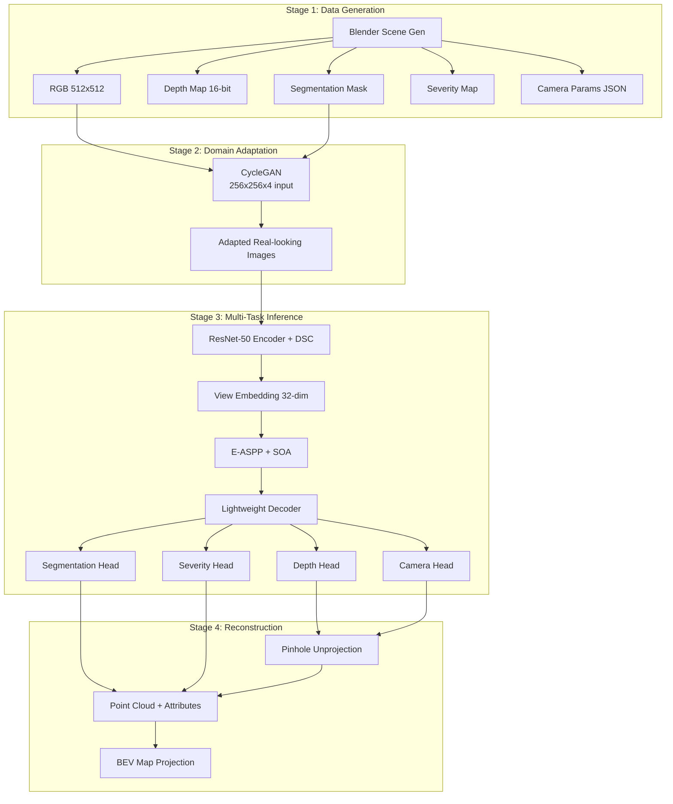

# Design Document: Road Quality Pipeline

## Overview

This document describes the technical design for a multi-task deep learning pipeline for road quality analysis with scene mapping via sim-to-real adaptation. The system implements four major stages:

1. **Synthetic Data Generation** — Blender Python API procedurally generates 3D road scenes with 5 defect types, producing aligned RGB, depth, segmentation, and severity ground truth.
2. **CycleGAN Domain Adaptation** — A segmentation-aware CycleGAN with ResNet-9 generators and PatchGAN discriminators translates synthetic images to realistic appearance while preserving defect geometry via a mask-aware loss.
3. **Multi-Task DeepLabV3+** — A modified DeepLabV3+ with ResNet-50 encoder (DSC in stages 3–4), 32-dim view embedding, E-ASPP with SOA, lightweight decoder, and 4 task heads simultaneously predict segmentation, severity, depth, and camera parameters.
4. **3D Reconstruction & BEV Mapping** — Per-frame depth unprojection, world-space transformation, point cloud aggregation, and orthographic BEV projection produce spatial defect maps.

The pipeline targets 27.83M parameters and ~56 FPS inference on a V100 GPU for the multi-task model.



## Architecture

### High-Level System Architecture

The pipeline is organized as four independent stages connected by standardized data formats:

```mermaid
flowchart LR
    subgraph DataGen["Synthetic Data Generation"]
        direction TB
        SceneGen[Scene Generator]
        Renderer[Multi-pass Renderer]
        DomRand[Domain Randomizer]
    end

    subgraph DomainAdapt["CycleGAN Domain Adaptation"]
        direction TB
        GenAB[Generator A→B]
        GenBA[Generator B→A]
        DiscA[Discriminator A]
        DiscB[Discriminator B]
    end

    subgraph MultiTask["Multi-Task Model"]
        direction TB
        Encoder[ResNet-50 + DSC]
        ASPP[E-ASPP + SOA]
        Decoder[Lightweight Decoder]
        Heads[4 Task Heads]
        DomAdapt[Domain Adapter]
    end

    subgraph Recon["3D Reconstruction"]
        direction TB
        Unproject[Depth Unprojection]
        Transform[World Transform]
        Aggregate[Point Cloud Agg]
        BEVProj[BEV Projection]
    end

    DataGen -->|Synthetic Dataset| DomainAdapt
    DomainAdapt -->|Adapted Images| MultiTask
    MultiTask -->|Predictions| Recon
```



### Design Decisions

| Decision | Choice | Rationale |
|----------|--------|-----------|
| Backbone | ResNet-50 with DSC in stages 3–4 | Balances accuracy and parameter count; DSC reduces params by ~60% in later stages |
| ASPP variant | E-ASPP (DSC-based) | Standard ASPP uses ~18M params; E-ASPP achieves similar receptive fields at ~3M params |
| Attention | SOA (channel + spatial + high-pass) | Specifically targets small, thin defects (cracks) that standard attention misses |
| Domain adaptation | Dual discriminator with GRL | Feature-level and output-level alignment provides stronger domain invariance |
| View conditioning | 32-dim embedding concatenated at bottleneck | Minimal param overhead; allows single model to handle both dashcam and drone |
| GAN type | LSGAN loss | More stable training than BCE; reduces mode collapse |
| Reconstruction | Per-frame unprojection + aggregation | Avoids need for learned depth completion; works with predicted camera params |

### Parameter Budget

| Component | Parameters (approx.) |
|-----------|---------------------|
| ResNet-50 encoder (with DSC) | ~15.2M |
| E-ASPP + SOA | ~3.8M |
| Decoder (3 blocks + SOA) | ~4.1M |
| Segmentation head | ~0.6M |
| Severity head | ~0.5M |
| Depth head | ~0.5M |
| Camera head | ~0.8M |
| View embedding | ~0.07M |
| Domain adapter | ~2.2M |
| **Total** | **~27.83M** |

## Components and Interfaces

### 1. Synthetic Data Generator (`synth/`)

```python
class SceneGenerator:
    """Procedurally generates 3D road scenes in Blender."""
    def __init__(self, config: SceneConfig) -> None: ...
    def generate_road_mesh(self, lanes: int, lane_width: float, length: float) -> bpy.types.Object: ...
    def place_defects(self, road: bpy.types.Object, defects: List[DefectSpec]) -> List[DefectInstance]: ...
    def apply_domain_randomization(self, scene: bpy.types.Scene) -> None: ...
    def setup_camera(self, view_type: Literal["dashcam", "drone"]) -> CameraConfig: ...
    def render(self, output_dir: Path) -> RenderOutputs: ...

class DatasetBuilder:
    """Orchestrates full dataset generation with proper splits."""
    def __init__(self, config: DatasetConfig) -> None: ...
    def generate_dataset(self, num_scenes: int, output_root: Path) -> DatasetManifest: ...
    def validate_no_overlap(self, defects: List[DefectInstance], threshold: float = 0.25) -> bool: ...
```

### 2. CycleGAN (`cyclegan/`)

```python
class ResNetGenerator(nn.Module):
    """ResNet-9 generator for image translation."""
    def __init__(self, input_nc: int = 4, output_nc: int = 3, ngf: int = 64, n_blocks: int = 9) -> None: ...
    def forward(self, x: Tensor) -> Tensor: ...  # x: [B, 4, 256, 256] -> [B, 3, 256, 256]

class PatchGANDiscriminator(nn.Module):
    """70x70 PatchGAN discriminator."""
    def __init__(self, input_nc: int = 3, ndf: int = 64) -> None: ...
    def forward(self, x: Tensor) -> Tensor: ...  # x: [B, 3, 256, 256] -> [B, 1, 30, 30]

class CycleGANTrainer:
    """Training loop with all loss components."""
    def __init__(self, config: CycleGANConfig) -> None: ...
    def train_step(self, real_A: Tensor, real_B: Tensor, mask_A: Tensor) -> Dict[str, float]: ...
    def compute_defect_preservation_loss(self, generated: Tensor, original_mask: Tensor) -> Tensor: ...
```

### 3. Multi-Task Model (`model/`)

```python
class ResNet50DSCEncoder(nn.Module):
    """ResNet-50 encoder with DSC in stages 3-4."""
    def __init__(self, pretrained: bool = True) -> None: ...
    def forward(self, x: Tensor) -> Dict[str, Tensor]: ...
    # Returns: {
    #   'stage1': [B, 256, 128, 128],
    #   'stage2': [B, 512, 64, 64],
    #   'stage3': [B, 1024, 32, 32],
    #   'stage4': [B, 2048, 16, 16]
    # }

class ViewEmbedding(nn.Module):
    """32-dim learnable view conditioning."""
    def __init__(self, num_views: int = 2, embed_dim: int = 32) -> None: ...
    def forward(self, features: Tensor, view_label: Tensor) -> Tensor: ...
    # features: [B, 2048, 16, 16] -> [B, 2080, 16, 16]

class EASPP(nn.Module):
    """Efficient ASPP with dilated DSC and SOA."""
    def __init__(self, in_channels: int = 2080, out_channels: int = 256) -> None: ...
    def forward(self, x: Tensor) -> Tensor: ...  # [B, 2080, 16, 16] -> [B, 256, 16, 16]

class SOA(nn.Module):
    """Small-Object Attention: channel + spatial + high-pass."""
    def __init__(self, channels: int, reduction: int = 16, alpha: float = 0.3) -> None: ...
    def forward(self, x: Tensor) -> Tensor: ...  # preserves shape

class LightweightDecoder(nn.Module):
    """3-block decoder with skip connections and SOA."""
    def __init__(self) -> None: ...
    def forward(self, aspp_out: Tensor, encoder_features: Dict[str, Tensor]) -> Tensor: ...
    # aspp_out: [B, 256, 16, 16] -> output: [B, 64, 128, 128]

class SegmentationHead(nn.Module):
    def __init__(self, in_channels: int = 64, num_classes: int = 3) -> None: ...
    def forward(self, x: Tensor) -> Tensor: ...  # [B, 64, 128, 128] -> [B, 3, 512, 512]

class SeverityHead(nn.Module):
    def __init__(self, in_channels: int = 64) -> None: ...
    def forward(self, x: Tensor) -> Tensor: ...  # [B, 64, 128, 128] -> [B, 1, 512, 512]

class DepthHead(nn.Module):
    def __init__(self, in_channels: int = 64) -> None: ...
    def forward(self, x: Tensor) -> Tensor: ...  # [B, 64, 128, 128] -> [B, 1, 512, 512]

class CameraHead(nn.Module):
    def __init__(self, in_channels: int = 64, spatial_size: int = 128) -> None: ...
    def forward(self, x: Tensor) -> Tuple[Tensor, Tensor]: ...
    # [B, 64, 128, 128] -> (intrinsics: [B, 4], extrinsics: [B, 6])

class MultiTaskModel(nn.Module):
    """Complete multi-task model combining all components."""
    def __init__(self, config: ModelConfig) -> None: ...
    def forward(self, x: Tensor, view_label: Tensor) -> Dict[str, Tensor]: ...
```

### 4. Domain Adapter (`model/domain_adapter.py`)

```python
class GradientReversalLayer(torch.autograd.Function):
    """GRL that negates gradients scaled by lambda."""
    @staticmethod
    def forward(ctx, x: Tensor, lambda_val: float) -> Tensor: ...
    @staticmethod
    def backward(ctx, grad_output: Tensor) -> Tuple[Tensor, None]: ...

class DomainDiscriminator(nn.Module):
    """3-layer conv discriminator for domain classification."""
    def __init__(self, in_channels: int, mid_channels: int = 256) -> None: ...
    def forward(self, x: Tensor) -> Tensor: ...

class DualDomainAdapter(nn.Module):
    """Feature + logit discriminators with GRL."""
    def __init__(self, feature_channels: int = 256, num_classes: int = 3, lambda_adv: float = 0.1) -> None: ...
    def forward(self, features: Tensor, logits: Tensor) -> Dict[str, Tensor]: ...
```

### 5. Reconstruction Module (`reconstruction/`)

```python
class DepthUnprojector:
    """Pinhole model unprojection."""
    def unproject(self, depth: np.ndarray, intrinsics: np.ndarray) -> np.ndarray: ...
    # depth: [H, W] -> points: [N, 3]

class WorldTransformer:
    """Applies extrinsics to transform points to world space."""
    def transform(self, points: np.ndarray, extrinsics: np.ndarray) -> np.ndarray: ...
    # points: [N, 3], extrinsics: [3, 4] -> world_points: [N, 3]

class PointCloudAggregator:
    """Accumulates multi-frame point clouds with attributes."""
    def __init__(self) -> None: ...
    def add_frame(self, points: np.ndarray, classes: np.ndarray, severities: np.ndarray) -> None: ...
    def filter(self, depth_confidence_threshold: float = 0.5, height_range: Tuple[float, float] = (-0.5, 0.5)) -> None: ...
    def export_ply(self, path: Path) -> None: ...

class BEVProjector:
    """Orthographic BEV map generation."""
    def __init__(self, resolution: float = 0.02) -> None: ...
    def project(self, aggregator: PointCloudAggregator) -> BEVMap: ...
    def export_png(self, bev_map: BEVMap, path: Path, color_map: Dict[int, Tuple[int, int, int]]) -> None: ...
```

### 6. Training Infrastructure (`training/`)

```python
class MultiTaskTrainer:
    """Orchestrates multi-task training with all losses."""
    def __init__(self, config: TrainingConfig) -> None: ...
    def train_epoch(self, dataloader: DataLoader) -> Dict[str, float]: ...
    def validate(self, dataloader: DataLoader) -> Dict[str, float]: ...
    def save_checkpoint(self, path: Path, is_best: bool = False) -> None: ...
    def load_checkpoint(self, path: Path) -> None: ...

class MetricsComputer:
    """Computes all evaluation metrics."""
    def compute_segmentation_metrics(self, pred: Tensor, target: Tensor) -> Dict[str, float]: ...
    def compute_depth_metrics(self, pred: Tensor, target: Tensor) -> Dict[str, float]: ...
    def compute_camera_metrics(self, pred_intr: Tensor, pred_extr: Tensor, gt_intr: Tensor, gt_extr: Tensor) -> Dict[str, float]: ...
    def compute_severity_metrics(self, pred: Tensor, target: Tensor, mask: Tensor) -> Dict[str, float]: ...
```

### 7. Configuration & Utilities (`utils/`)

```python
class ConfigLoader:
    """YAML config loading with defaults and CLI overrides."""
    def __init__(self, config_path: Path, overrides: Optional[Dict[str, Any]] = None) -> None: ...
    def validate(self) -> None: ...
    def get(self, key: str, default: Any = None) -> Any: ...

class ExperimentLogger:
    """JSON lines + TensorBoard logging."""
    def __init__(self, log_dir: Path, tb_dir: Path) -> None: ...
    def log_scalars(self, metrics: Dict[str, float], step: int) -> None: ...
    def log_images(self, images: Dict[str, Tensor], step: int) -> None: ...
    def log_diagnostic(self, grad_norms: List[float], losses: List[float]) -> None: ...
```

## Data Models

### Configuration Schema

```yaml
# config.yaml
data:
  root: "/data/road_quality"
  train_split: 0.8
  val_split: 0.1
  test_split: 0.1
  num_workers: 4
  pin_memory: true
  prefetch_factor: 2

scene_generation:
  road:
    lanes: [1, 4]           # min, max
    lane_width: [3.0, 3.75] # meters
    road_length: [50, 200]  # meters
  defects:
    count: [1, 10]
    types: [crack, pothole, puddle, patch, manhole]
    overlap_threshold: 0.25
  camera:
    dashcam:
      height: [1.2, 1.5]    # meters
      pitch: [-15, -5]      # degrees
    drone:
      height: [8, 15]       # meters
      pitch: [-90, -60]     # degrees
  domain_randomization:
    hdri_count: 20
    vehicles: [0, 5]
    weather: [clear, overcast, rain]
  dataset_size: 16036
  render_size: 512

cyclegan:
  input_size: 256
  input_nc: 4
  output_nc: 3
  ngf: 64
  ndf: 64
  n_blocks: 9
  training:
    epochs: 200
    lr: 0.0002
    beta1: 0.5
    beta2: 0.999
    decay_start_epoch: 100
    pool_size: 50
    lambda_cycle: 10.0
    lambda_identity: 0.5
    lambda_defect: 5.0

model:
  encoder:
    backbone: resnet50
    pretrained: true
    dsc_stages: [3, 4]
  view_embedding:
    num_views: 2
    embed_dim: 32
  easpp:
    dilations: [3, 6, 12, 18]
    out_channels: 256
  soa:
    reduction: 16
    alpha: 0.3
    gaussian_kernel: 7
    gaussian_sigma: 1.0
  decoder:
    channels: [256, 128, 64]
  heads:
    segmentation:
      num_classes: 3
      hidden_channels: 128
    severity:
      hidden_channels: 128
    depth:
      hidden_channels: 128
    camera:
      hidden_dim: [512, 256]
      intrinsic_params: 4
      extrinsic_params: 6

training:
  epochs: 200
  optimizer:
    type: adam
    lr: 0.0001
    beta1: 0.9
    beta2: 0.999
    weight_decay: 0.00001
  scheduler:
    type: reduce_on_plateau
    patience: 10
    factor: 0.5
  early_stopping_patience: 30
  loss_weights:
    segmentation: 1.5
    depth: 1.0
    camera: 0.3
    adversarial: 0.1
    view: 0.1
  amp: true
  grad_clip_norm: 1.0

domain_adaptation:
  lambda_adv: 0.1
  feature_disc:
    channels: [256, 128, 1]
    kernel_size: 3
    stride: 2
  logit_disc:
    channels: [256, 128, 1]
    kernel_size: 3
    stride: 2

reconstruction:
  depth_confidence_threshold: 0.5
  height_range: [-0.5, 0.5]
  bev_resolution: 0.02

evaluation:
  segmentation: [miou, per_class_iou, pixel_accuracy, mean_class_accuracy]
  depth: [rmse, abs_rel, delta_1, delta_2, delta_3]
  camera: [intrinsic_mae, rotation_geodesic, translation_error]
  severity: [mae, pearson_correlation]

logging:
  tb_log_interval: 100
  console_log_interval: 10
  checkpoint_interval: 5

seed: 42
```

### Core Data Structures

```python
from dataclasses import dataclass, field
from typing import List, Dict, Tuple, Optional, Literal
from pathlib import Path
import numpy as np
import torch

@dataclass
class DefectSpec:
    defect_type: Literal["crack", "pothole", "puddle", "patch", "manhole"]
    position: Tuple[float, float]  # (x, y) on road surface
    orientation: float             # degrees, 0-360
    scale: Tuple[float, ...]       # type-dependent dimensions

@dataclass
class DefectInstance:
    spec: DefectSpec
    mesh_object: object           # bpy.types.Object reference
    bounding_box_2d: Tuple[float, float, float, float]  # (x_min, y_min, x_max, y_max)
    area: float                   # m²

@dataclass
class CameraConfig:
    view_type: Literal["dashcam", "drone"]
    height: float
    pitch: float
    intrinsics: np.ndarray        # [3, 3]
    extrinsics: np.ndarray        # [3, 4]

@dataclass
class RenderOutputs:
    rgb: Path                     # 512x512 RGB PNG
    depth: Path                   # 512x512 16-bit PNG (mm)
    segmentation: Path            # 512x512 integer-encoded PNG
    severity: Path                # 512x512 float32 EXR/NPY
    camera_params: Path           # JSON with K and [R|t]

@dataclass
class DatasetManifest:
    root: Path
    total_samples: int
    splits: Dict[str, int]        # {"train": N, "val": N, "test": N}
    samples: List[Dict]           # per-sample metadata

@dataclass
class ModelOutput:
    segmentation: torch.Tensor    # [B, 3, 512, 512] logits
    severity: torch.Tensor        # [B, 1, 512, 512] in [0, 1]
    depth: torch.Tensor           # [B, 1, 512, 512] in [0, 1]
    intrinsics: torch.Tensor      # [B, 4] (fx, fy, cx, cy)
    extrinsics: torch.Tensor      # [B, 6] (rodrigues3, translation3)

@dataclass
class PointCloudData:
    positions: np.ndarray         # [N, 3] world coordinates
    colors: np.ndarray            # [N, 3] RGB
    classes: np.ndarray           # [N] defect class IDs
    severities: np.ndarray        # [N] severity values

@dataclass
class BEVMap:
    image: np.ndarray             # [H, W, 3] color-coded
    class_grid: np.ndarray        # [H, W] defect class per cell
    severity_grid: np.ndarray     # [H, W] max severity per cell
    origin: Tuple[float, float]   # world-space origin (x, y)
    resolution: float             # meters per pixel

@dataclass
class Checkpoint:
    epoch: int
    model_state_dict: Dict
    optimizer_state_dict: Dict
    scheduler_state_dict: Dict
    best_metric: float
    rng_states: Dict[str, object]  # python, numpy, torch, cuda
```

## Correctness Properties

*A property is a characteristic or behavior that should hold true across all valid executions of a system — essentially, a formal statement about what the system should do. Properties serve as the bridge between human-readable specifications and machine-verifiable correctness guarantees.*

### Property 1: Camera parameters serialization round-trip

*For any* valid 3×3 intrinsics matrix and 3×4 extrinsics matrix, serializing to JSON and deserializing SHALL produce numerically equivalent matrices (within floating-point tolerance of 1e-6).

**Validates: Requirements 1.4, 2.5**

### Property 2: Defect placement respects overlap constraint

*For any* set of 1–10 randomly placed defects on a road surface, after the overlap resolution algorithm runs, no pair of defect instances SHALL overlap by more than 25% of the smaller defect's area, and all defects SHALL remain within the road surface bounds.

**Validates: Requirements 1.8**

### Property 3: Dataset split and viewpoint balance

*For any* total dataset size within [15876, 16196], the train/val/test split SHALL produce counts within 80%/10%/10% (±1%) of total, and each viewpoint (dashcam/drone) SHALL comprise 50% ±2% of the total images.

**Validates: Requirements 1.7**

### Property 4: Depth map normalization round-trip

*For any* depth array with arbitrary positive min and max values, normalizing to uint16 [0, 65535] and denormalizing back SHALL preserve the relative ordering of all pixel values and recover original values within quantization error (max_depth - min_depth) / 65535.

**Validates: Requirements 2.4**

### Property 5: Segmentation mask encoding validity

*For any* generated segmentation mask, all pixel values SHALL be integers in the set {0, 1, 2} (background, road, defect), and the encoded array SHALL have dtype compatible with integer storage.

**Validates: Requirements 2.2, 2.3**

### Property 6: Generator output bounded by tanh

*For any* valid input tensor of shape [B, 4, 256, 256] with RGB channels in [-1, 1] and mask channel in {0, 1}, the Generator SHALL produce an output of shape [B, 3, 256, 256] with all values in the range [-1, 1].

**Validates: Requirements 3.4**

### Property 7: Discriminator spatial output dimensions

*For any* input tensor of shape [B, 3, 256, 256], the PatchGAN Discriminator SHALL produce an output of exactly shape [B, 1, 30, 30].

**Validates: Requirements 4.1**

### Property 8: CycleGAN loss weighted summation

*For any* set of non-negative loss component values (adversarial, cycle, identity, defect), the total generator loss SHALL equal adversarial + 10.0×cycle + 0.5×identity + 5.0×defect for each translation direction.

**Validates: Requirements 5.5**

### Property 9: Learning rate linear decay schedule

*For any* epoch number e in [0, 200), the CycleGAN learning rate SHALL equal 2e-4 when e < 100, and SHALL equal 2e-4 × (200 - e) / 100 when e ≥ 100.

**Validates: Requirements 5.7**

### Property 10: Image history buffer capacity

*For any* sequence of generated images inserted into the history buffer, the buffer size SHALL never exceed 50 images, and sampling from the buffer SHALL only return previously inserted images.

**Validates: Requirements 5.8**

### Property 11: Encoder multi-scale output shapes

*For any* input tensor of shape [B, 3, 512, 512], the ResNet-50 DSC encoder SHALL produce feature maps at shapes: stage1=[B, 256, 128, 128], stage2=[B, 512, 64, 64], stage3=[B, 1024, 32, 32], stage4=[B, 2048, 16, 16].

**Validates: Requirements 6.2**

### Property 12: View embedding channel augmentation

*For any* feature tensor of shape [B, 2048, H, W] and valid view label in {0, 1}, the View Embedding module SHALL produce an output of shape [B, 2080, H, W] where the first 2048 channels equal the input features.

**Validates: Requirements 6.3**

### Property 13: E-ASPP dimension reduction

*For any* input tensor of shape [B, 2080, 16, 16], the E-ASPP module SHALL produce an output of exactly shape [B, 256, 16, 16].

**Validates: Requirements 7.3, 7.4**

### Property 14: SOA shape preservation and attention validity

*For any* input tensor of arbitrary spatial dimensions and channel count, the SOA module SHALL produce an output of identical shape. Additionally, the internal channel attention weights SHALL be in [0, 1] and spatial attention maps SHALL be in [0, 1].

**Validates: Requirements 8.5, 8.1, 8.2**

### Property 15: Decoder output dimensions from multi-scale inputs

*For any* E-ASPP output of shape [B, 256, 16, 16] and encoder features at the specified resolutions, the Decoder SHALL produce an output of shape [B, 64, 128, 128].

**Validates: Requirements 9.1, 9.4**

### Property 16: Task heads output shapes and value ranges

*For any* shared decoder feature map of shape [B, 64, 128, 128]:
- The segmentation head SHALL produce shape [B, 3, 512, 512] (unbounded logits)
- The severity head SHALL produce shape [B, 1, 512, 512] with all values in [0, 1]
- The depth head SHALL produce shape [B, 1, 512, 512] with all values in [0, 1]
- The camera head SHALL produce intrinsics of shape [B, 4] with all values > 0 (softplus) and extrinsics of shape [B, 6]

**Validates: Requirements 10.1, 10.2, 10.3, 10.4**

### Property 17: Gradient Reversal Layer forward-backward semantics

*For any* input tensor x and scaling factor λ, the GRL forward pass SHALL return x unchanged, and during backpropagation the gradient SHALL be negated and scaled by -λ.

**Validates: Requirements 11.2, 11.3**

### Property 18: Multi-task total loss computation

*For any* non-negative loss components (L_seg, L_depth, L_cam, L_adv, L_view), the total loss SHALL equal 1.5×L_seg + 1.0×L_depth + 0.3×L_cam + 0.1×L_adv + 0.1×L_view.

**Validates: Requirements 12.1**

### Property 19: Pinhole unprojection round-trip

*For any* set of 3D points with positive Z coordinates and a valid intrinsics matrix K, projecting points to pixel coordinates via K and then unprojecting with the same K and original depth values SHALL recover the original 3D points within floating-point tolerance (1e-5).

**Validates: Requirements 13.1**

### Property 20: Extrinsics transformation round-trip

*For any* set of 3D points and a valid rigid transformation [R|t] where R is orthonormal, applying the forward transform followed by the inverse transform SHALL recover the original points within floating-point tolerance (1e-5).

**Validates: Requirements 13.2**

### Property 21: Point cloud aggregation preserves all data

*For any* sequence of N frames, each with arbitrary point counts, after aggregation the total point count SHALL equal the sum of all per-frame point counts, and every point's attributes (position, class, severity) SHALL be preserved exactly.

**Validates: Requirements 13.3**

### Property 22: Point cloud filtering correctness

*For any* point cloud, after filtering with a depth confidence threshold and height range, all remaining points SHALL have confidence ≥ threshold AND height within the specified range. No point satisfying both criteria SHALL be removed.

**Validates: Requirements 13.4**

### Property 23: BEV cell class assignment by majority vote

*For any* set of points mapping to the same BEV grid cell, the cell's assigned defect class SHALL be the class with the highest frequency among contributing points, and the cell's severity SHALL be the maximum severity value among those points.

**Validates: Requirements 14.2**

### Property 24: PLY export round-trip

*For any* point cloud with N points each having position (3 floats), color (3 uint8), class (int), and severity (float), exporting to PLY and re-reading SHALL recover all N points with identical attribute values.

**Validates: Requirements 14.3**

### Property 25: Augmentation geometric consistency

*For any* image-mask pair, applying the training augmentation pipeline (flip, rotation, crop) SHALL produce outputs where spatial correspondence is preserved — specifically, if pixel (u, v) in the original image corresponds to class c in the mask, then after identical geometric transforms, the same spatial location in the transformed image SHALL correspond to class c in the transformed mask.

**Validates: Requirements 16.1**

### Property 26: Evaluation metrics validity and identity

*For any* prediction and target tensor pair:
- All metric values SHALL be non-negative
- mIoU, pixel accuracy, and delta thresholds SHALL be in [0, 1]
- When prediction equals target exactly, mIoU SHALL equal 1.0, RMSE SHALL equal 0.0, and all delta thresholds SHALL equal 1.0

**Validates: Requirements 17.1, 17.2, 17.3, 17.4**

### Property 27: Checkpoint serialization round-trip

*For any* training state (model weights, optimizer state, scheduler state, epoch, best metric, RNG states), saving a checkpoint and loading it back SHALL produce an identical training state — subsequent forward passes and optimizer steps SHALL produce bit-identical results.

**Validates: Requirements 18.1**

### Property 28: Seed determinism

*For any* random seed value, two independent executions of the same computation (model initialization, data sampling, training step) with the same seed SHALL produce bit-identical results.

**Validates: Requirements 18.4**

### Property 29: YAML configuration round-trip

*For any* valid configuration dictionary, writing to YAML and reading back SHALL produce an equivalent dictionary with all values preserved.

**Validates: Requirements 19.1**

### Property 30: Configuration defaults for partial configs

*For any* valid partial configuration (subset of keys), loading SHALL produce a complete configuration where all unspecified parameters have their documented default values and all specified parameters retain their provided values.

**Validates: Requirements 19.2**

### Property 31: Configuration validation rejects invalid values

*For any* configuration containing values outside valid ranges (negative learning rates, empty required paths, dilation rates ≤ 0, loss weights < 0), validation SHALL raise a clear error identifying the invalid parameter.

**Validates: Requirements 19.3**

### Property 32: CLI dot-notation override application

*For any* valid configuration and a set of dot-notation overrides (e.g., "training.lr=1e-3"), after applying overrides the configuration SHALL have the specified nested key set to the override value while all other keys remain unchanged.

**Validates: Requirements 19.4**

## Error Handling

### Training Divergence Detection

| Condition | Detection | Response |
|-----------|-----------|----------|
| NaN/Inf in CycleGAN loss | Check each loss component after computation | Halt training, save last valid checkpoint with epoch number |
| NaN/Inf in multi-task loss | Check total loss before backward pass | Halt training, log last 10 gradient norms and losses, save diagnostic checkpoint |
| Gradient explosion | Monitor gradient norm after clipping | Log warning if pre-clip norm exceeds 10× clip threshold |
| Learning rate reaches minimum | Monitor LR after scheduler step | Log info, continue training at minimum LR (1e-7) |

### Data Pipeline Errors

| Condition | Detection | Response |
|-----------|-----------|----------|
| Corrupt image file | Catch PIL/OpenCV decode exception | Log warning, skip sample, continue with next |
| Missing label file | Check file existence before loading | Raise ValueError with clear path info |
| Shape mismatch (image vs mask) | Assert shapes match after loading | Raise ValueError with shape details |
| Empty batch (all samples skipped) | Check batch size after collation | Log error, fetch next batch |

### Reconstruction Errors

| Condition | Detection | Response |
|-----------|-----------|----------|
| Invalid intrinsics (det ≈ 0) | Check matrix determinant | Skip frame, log warning |
| Depth map all zeros | Check for valid depth pixels | Skip frame, log warning |
| Point cloud empty after filtering | Check point count after filter | Return empty BEV map, log info |
| PLY write failure | Catch IOError | Retry once, then raise with path info |

### Configuration Errors

| Condition | Detection | Response |
|-----------|-----------|----------|
| Invalid YAML syntax | Catch yaml.YAMLError | Report line number and error |
| Missing required field | Schema validation | List all missing fields |
| Type mismatch | Schema validation | Report field, expected type, actual type |
| Invalid override syntax | Parse dot-notation | Report malformed override string |

## Testing Strategy

### Testing Approach

The pipeline uses a dual testing approach:

1. **Property-Based Tests** — Verify universal correctness properties across randomized inputs using `hypothesis` (Python). Minimum 100 iterations per property. These cover mathematical invariants, shape properties, round-trip serialization, and value range constraints.

2. **Unit Tests** — Verify specific examples, architectural requirements, edge cases, and integration points using `pytest`. These cover model layer inspection, specific known-good computations, and error conditions.

### Property-Based Testing Configuration

- **Library**: `hypothesis` with `hypothesis[numpy]` and custom PyTorch strategies
- **Iterations**: Minimum 100 per property (configurable via `@settings(max_examples=100)`)
- **Tag format**: `# Feature: road-quality-pipeline, Property {N}: {title}`
- **Profiles**: CI uses 100 examples, local dev uses 50 for speed

### Test Organization

```
tests/
├── properties/               # Property-based tests
│   ├── test_serialization.py # Properties 1, 4, 5, 24, 27, 29
│   ├── test_geometry.py      # Properties 2, 3, 19, 20, 21, 22, 23, 25
│   ├── test_model_shapes.py  # Properties 6, 7, 11, 12, 13, 14, 15, 16
│   ├── test_losses.py        # Properties 8, 9, 10, 17, 18
│   ├── test_metrics.py       # Property 26
│   ├── test_config.py        # Properties 29, 30, 31, 32
│   └── test_training.py      # Property 28
├── unit/                     # Example-based unit tests
│   ├── test_generator_arch.py
│   ├── test_discriminator_arch.py
│   ├── test_encoder_arch.py
│   ├── test_decoder_arch.py
│   ├── test_data_loading.py
│   └── test_logging.py
├── integration/              # Integration tests
│   ├── test_blender_render.py
│   ├── test_cyclegan_training.py
│   ├── test_multitask_training.py
│   ├── test_torchscript_export.py
│   └── test_reconstruction_pipeline.py
└── conftest.py               # Shared fixtures, hypothesis profiles
```

### Unit Test Coverage

Unit tests cover architectural requirements not suited for PBT:
- Model layer structure verification (conv filter counts, normalization placement, activation types)
- Pretrained weight loading behavior
- DataLoader configuration parameters
- TensorBoard event file generation
- End-to-end pipeline integration (small-scale)

### Edge Cases Handled by Property Generators

The property-based test generators are configured to include edge cases:
- Empty point clouds, single-point clouds
- Depth maps with all-zero or all-max values
- Segmentation masks with single class present
- Degenerate intrinsics (near-singular)
- Config files with minimal vs maximal parameter sets
- Zero-length and maximum-length road segments

### Performance Testing

- Parameter count verification (smoke test, run once)
- Inference throughput benchmark (integration test on target hardware)
- Memory usage profiling for batch sizes 1–16

