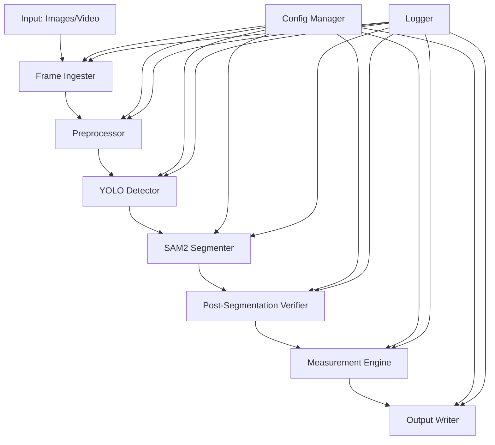
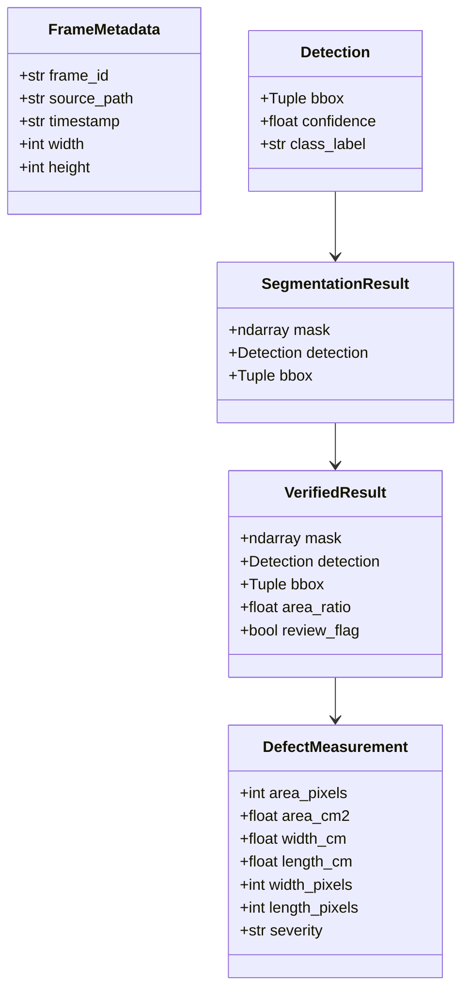
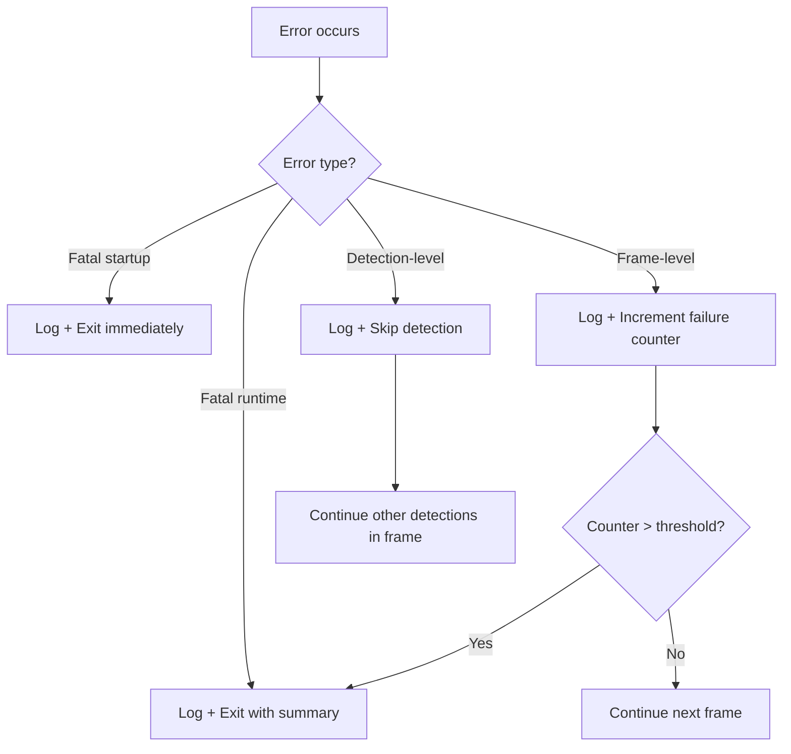

# Design Document: Road Defect Segmentation Pipeline

## Overview

This document describes the technical design for a road defect segmentation pipeline that processes GoPro-captured road corridor imagery to detect, segment, and measure road surface defects. The pipeline is a sequential processing system where each stage transforms data and passes it to the next: ingestion → preprocessing → detection → segmentation → verification → measurement → output.

The system is implemented in Python, leveraging OpenCV for image processing, Ultralytics YOLOv8 for object detection, Meta's SAM2 for segmentation, and pycocotools for COCO-format RLE mask encoding. Configuration is managed via YAML, and all outputs are structured JSON.

### Key Design Decisions

1. **Sequential pipeline with per-frame error isolation**: Each frame is processed independently. A failure in one frame does not affect subsequent frames, enabling resilient batch processing.
2. **MPS-first with CPU fallback**: The pipeline targets Apple Silicon (M1) with MPS (Metal Performance Shaders) via PyTorch's MPS backend for inference, with components structured to allow CPU fallback where feasible.
3. **Single-process, batched inference**: SAM2 batches all ROIs per frame into one inference call to minimize GPU context switching. YOLO processes one frame at a time.
4. **Configuration-driven behavior**: All tunable parameters are externalized to YAML, with validated defaults at startup.

## Architecture



### Pipeline Execution Flow

1. **Startup**: Load configuration from YAML, validate all parameters, initialize models (YOLO weights, SAM2 checkpoint), set up logging.
2. **Ingestion**: Accept input files (images or video), validate formats and resolutions, yield individual frames.
3. **Processing Loop**: For each frame, execute the preprocessing → detection → segmentation → verification → measurement chain.
4. **Output**: Write per-frame JSON records and a batch summary report.
5. **Shutdown**: Log batch statistics and exit.

### Failure Handling Strategy

- **Fatal errors** (config invalid, model load failure, output directory inaccessible): Exit immediately with descriptive error.
- **Recoverable errors** (single frame failure, corrupt input): Log and skip, continue processing.
- **Systematic failure detection**: Track consecutive frame failures; exit if threshold exceeded.

## Components and Interfaces

### 1. ConfigManager

**Responsibility**: Load, validate, and provide access to pipeline configuration.

```python
@dataclass
class PipelineConfig:
    # Ingestion
    frame_extraction_rate: float = 1.0  # fps, range [0.1, 30]
    
    # Preprocessing
    clip_limit: float = 2.0
    tile_grid_size: Tuple[int, int] = (8, 8)
    distortion_coefficients: Optional[List[float]] = None  # [k1, k2, p1, p2, k3]
    camera_matrix: Optional[List[List[float]]] = None
    
    # Detection
    confidence_threshold: float = 0.5  # range [0.0, 1.0]
    iou_threshold: float = 0.45  # range [0.0, 1.0]
    max_detections: int = 50
    yolo_model_path: str = "models/yolo_road_defects.pt"
    
    # Segmentation
    sam2_checkpoint_path: str = "models/sam2_checkpoint.pth"
    sam2_model_cfg: str = "sam2_hiera_l.yaml"
    
    # Verification
    min_area_ratio: float = 0.05  # range [0.0, 1.0]
    max_area_ratio: float = 0.95  # range [0.0, 1.0]
    
    # Measurement
    camera_height_cm: Optional[float] = None
    focal_length_px: Optional[float] = None
    
    # Output
    output_directory: str = "output"
    
    # Error handling
    max_consecutive_failures: int = 10
    log_level: str = "INFO"  # DEBUG, INFO, WARNING, ERROR

class ConfigManager:
    def load(self, config_path: str) -> PipelineConfig: ...
    def validate(self, config: PipelineConfig) -> List[str]: ...
```

**Interface contract**:
- `load()` reads YAML, applies defaults for missing fields, returns `PipelineConfig`.
- `validate()` checks all values against documented ranges, returns list of error messages (empty if valid).

### 2. FrameIngester

**Responsibility**: Accept image files or video files and yield individual frames as numpy arrays.

```python
@dataclass
class FrameMetadata:
    frame_id: str          # Unique identifier (filename or video_name_frameNNN)
    source_path: str       # Original file path
    timestamp: str         # ISO 8601 timestamp
    width: int
    height: int

class FrameIngester:
    def ingest(self, input_path: str) -> Generator[Tuple[np.ndarray, FrameMetadata], None, None]: ...
    def _is_image(self, path: str) -> bool: ...
    def _is_video(self, path: str) -> bool: ...
    def _extract_video_frames(self, path: str, fps: float) -> Generator[Tuple[np.ndarray, FrameMetadata], None, None]: ...
    def _validate_resolution(self, frame: np.ndarray) -> bool: ...
```

**Interface contract**:
- Yields `(frame_array, metadata)` tuples for each valid frame.
- Skips corrupt/unreadable frames with a logged warning.
- Raises `UnsupportedFormatError` for non-JPEG/PNG/MP4/MOV files.
- Raises `ResolutionError` for frames outside 64x64 to 5312x2988.

### 3. Preprocessor

**Responsibility**: Correct barrel distortion, reduce motion blur, and normalize exposure.

```python
class Preprocessor:
    def __init__(self, config: PipelineConfig): ...
    def process(self, frame: np.ndarray) -> np.ndarray: ...
    def _correct_barrel_distortion(self, frame: np.ndarray) -> np.ndarray: ...
    def _reduce_motion_blur(self, frame: np.ndarray) -> np.ndarray: ...
    def _apply_clahe(self, frame: np.ndarray) -> np.ndarray: ...
```

**Interface contract**:
- Input: 8-bit RGB numpy array of shape (H, W, 3).
- Output: 8-bit RGB numpy array of same shape (H, W, 3).
- Processing order is fixed: distortion correction → motion blur reduction → CLAHE.
- On failure, returns the original frame unchanged and logs a warning.

**Implementation notes**:
- Barrel distortion uses `cv2.undistort()` with a 5-parameter distortion model (k1, k2, p1, p2, k3) and a 3x3 camera intrinsic matrix.
- Motion blur reduction uses a Wiener deconvolution filter or unsharp masking.
- CLAHE is applied per-channel in LAB color space (L channel only) using `cv2.createCLAHE()`.

### 4. YOLODetector

**Responsibility**: Run YOLO inference to detect road defects and produce bounding boxes.

```python
@dataclass
class Detection:
    bbox: Tuple[int, int, int, int]  # (x, y, width, height) in frame coordinates
    confidence: float
    class_label: str  # pothole, longitudinal_crack, transverse_crack, alligator_cracking, patch_deterioration

class YOLODetector:
    def __init__(self, config: PipelineConfig): ...
    def load_model(self) -> None: ...
    def detect(self, frame: np.ndarray) -> List[Detection]: ...
    def _apply_nms(self, detections: List[Detection]) -> List[Detection]: ...
    def _filter_confidence(self, detections: List[Detection]) -> List[Detection]: ...
```

**Interface contract**:
- `load_model()` loads weights from `yolo_model_path`. Raises `ModelLoadError` on failure.
- `detect()` returns a list of `Detection` objects, filtered by confidence threshold and NMS.
- Returns empty list if no defects found.
- Detections are capped at `max_detections`.

**Implementation notes**:
- Uses Ultralytics Python API: `model = YOLO(path)`, `results = model.predict(frame, conf=threshold, iou=iou_threshold, max_det=max_detections)`.
- NMS is handled internally by Ultralytics with the configured IoU threshold.

### 5. SAM2Segmenter

**Responsibility**: Generate pixel-precise segmentation masks for each detected defect using box prompts.

```python
@dataclass
class SegmentationResult:
    mask: np.ndarray        # Binary mask (H, W), dtype=uint8, values 0 or 1
    detection: Detection    # The originating detection
    bbox: Tuple[int, int, int, int]  # Original bounding box

class SAM2Segmenter:
    def __init__(self, config: PipelineConfig): ...
    def load_model(self) -> None: ...
    def segment(self, frame: np.ndarray, detections: List[Detection]) -> List[SegmentationResult]: ...
    def _validate_bbox(self, bbox: Tuple[int, int, int, int], frame_shape: Tuple[int, int]) -> bool: ...
    def _prepare_box_prompts(self, detections: List[Detection]) -> np.ndarray: ...
```

**Interface contract**:
- `load_model()` loads SAM2 checkpoint. Raises `ModelLoadError` on failure.
- `segment()` accepts a frame and list of detections, returns a list of `SegmentationResult`.
- Invalid bounding boxes (zero dimensions, out of frame) are skipped with a warning.
- Masks with zero foreground pixels are discarded with a warning.
- All valid detections are batched into a single SAM2 inference call.

**Implementation notes**:
- Uses the SAM2 image predictor API from `sam2.sam2_image_predictor.SAM2ImagePredictor`.
- Box prompts are in (x1, y1, x2, y2) format, converted from YOLO's (x, y, w, h).
- `predictor.set_image(frame)` is called once per frame, then `predictor.predict(box=boxes, multimask_output=False)` batches all boxes.

### 6. PostSegmentationVerifier

**Responsibility**: Validate segmentation quality through area ratio filtering and connected component cleanup.

```python
@dataclass
class VerifiedResult:
    mask: np.ndarray              # Cleaned binary mask
    detection: Detection
    bbox: Tuple[int, int, int, int]
    area_ratio: float
    review_flag: bool             # True if ratio > max_area_ratio

class PostSegmentationVerifier:
    def __init__(self, config: PipelineConfig): ...
    def verify(self, results: List[SegmentationResult]) -> List[VerifiedResult]: ...
    def _compute_area_ratio(self, mask: np.ndarray, bbox: Tuple[int, int, int, int]) -> float: ...
    def _clean_connected_components(self, mask: np.ndarray) -> np.ndarray: ...
```

**Interface contract**:
- Filters out masks with area ratio below `min_area_ratio`.
- Flags masks with area ratio above `max_area_ratio` (sets `review_flag=True`).
- Retains only the largest connected component (8-connectivity) in each mask.
- Returns only masks that pass verification.

### 7. MeasurementEngine

**Responsibility**: Compute defect area, dimensions, and severity from verified masks.

```python
@dataclass
class DefectMeasurement:
    area_pixels: int
    area_cm2: Optional[float]           # None if camera params not provided
    width_cm: Optional[float]           # None if camera params not provided
    length_cm: Optional[float]          # None if camera params not provided
    width_pixels: int
    length_pixels: int
    severity: Optional[str]             # "minor", "moderate", "severe", or None

class MeasurementEngine:
    def __init__(self, config: PipelineConfig): ...
    def measure(self, verified_result: VerifiedResult) -> DefectMeasurement: ...
    def _pixel_to_cm2(self, pixel_area: int) -> float: ...
    def _compute_severity(self, area_cm2: float) -> str: ...
    def _compute_bounding_dimensions(self, mask: np.ndarray) -> Tuple[int, int]: ...
```

**Interface contract**:
- Always computes pixel-based measurements.
- Computes metric measurements only when `camera_height_cm` and `focal_length_px` are both provided and positive.
- Severity assignment: minor (<500 cm²), moderate (500–2000 cm²), severe (>2000 cm²).
- Returns `None` for metric fields and severity when camera parameters are unavailable.

**Implementation notes**:
- Ground-plane projection: `pixel_size_cm = camera_height_cm / focal_length_px`, then `area_cm2 = area_pixels * (pixel_size_cm ** 2)`.
- Bounding dimensions computed from the mask's non-zero pixel extent (max_row - min_row, max_col - min_col).

### 8. OutputWriter

**Responsibility**: Serialize pipeline results to JSON files.

```python
class OutputWriter:
    def __init__(self, config: PipelineConfig): ...
    def write_frame_result(self, frame_metadata: FrameMetadata, defects: List[DefectOutput]) -> None: ...
    def write_batch_summary(self, summary: BatchSummary) -> None: ...
    def _encode_mask_rle(self, mask: np.ndarray) -> Dict[str, Any]: ...
```

**Interface contract**:
- Writes one JSON file per frame, named `{frame_id}.json`.
- Writes a `batch_summary.json` at end of run.
- Masks are encoded using `pycocotools.mask.encode()` (COCO compressed RLE format).
- Validates output directory is writable at startup.

### 9. PipelineOrchestrator

**Responsibility**: Coordinate all components, manage the processing loop, and handle error tracking.

```python
class PipelineOrchestrator:
    def __init__(self, config_path: str): ...
    def run(self, input_paths: List[str]) -> None: ...
    def _process_frame(self, frame: np.ndarray, metadata: FrameMetadata) -> Optional[FrameResult]: ...
    def _check_consecutive_failures(self) -> None: ...
```

## Data Models

### Configuration Schema (YAML)

```yaml
pipeline:
  frame_extraction_rate: 1.0      # [0.1, 30] fps

preprocessing:
  clip_limit: 2.0
  tile_grid_size: [8, 8]
  distortion_coefficients: null   # [k1, k2, p1, p2, k3] or null for defaults
  camera_matrix: null             # 3x3 intrinsic matrix or null for defaults

detection:
  model_path: "models/yolo_road_defects.pt"
  confidence_threshold: 0.5       # [0.0, 1.0]
  iou_threshold: 0.45            # [0.0, 1.0]
  max_detections: 50

segmentation:
  checkpoint_path: "models/sam2_checkpoint.pth"
  model_cfg: "sam2_hiera_l.yaml"

verification:
  min_area_ratio: 0.05           # [0.0, 1.0]
  max_area_ratio: 0.95           # [0.0, 1.0]

measurement:
  camera_height_cm: null          # positive float or null
  focal_length_px: null           # positive float or null

output:
  directory: "output"

logging:
  level: "INFO"                   # DEBUG, INFO, WARNING, ERROR
  max_consecutive_failures: 10
```

### Per-Frame Output JSON

```json
{
  "frame_id": "video001_frame_0042",
  "timestamp": "2024-03-15T10:30:42Z",
  "source_file": "video001.mp4",
  "defects": [
    {
      "class": "pothole",
      "confidence": 0.87,
      "bounding_box": {
        "x": 120,
        "y": 340,
        "width": 200,
        "height": 150
      },
      "segmentation": {
        "size": [2988, 5312],
        "counts": "encoded_rle_string"
      },
      "measurements": {
        "area_pixels": 18500,
        "area_cm2": 2450.3,
        "width_cm": 45.2,
        "length_cm": 62.1,
        "width_pixels": 180,
        "length_pixels": 140,
        "severity": "severe"
      },
      "review_flag": false
    }
  ]
}
```

### Batch Summary JSON

```json
{
  "total_frames_processed": 1500,
  "total_defects_detected": 237,
  "defects_by_class": {
    "pothole": 89,
    "longitudinal_crack": 52,
    "transverse_crack": 41,
    "alligator_cracking": 33,
    "patch_deterioration": 22
  },
  "defects_by_severity": {
    "minor": 112,
    "moderate": 78,
    "severe": 47
  },
  "processing_time_seconds": 842.5,
  "average_time_per_frame_seconds": 0.562
}
```

### Internal Data Flow Types




## Correctness Properties

*A property is a characteristic or behavior that should hold true across all valid executions of a system — essentially, a formal statement about what the system should do. Properties serve as the bridge between human-readable specifications and machine-verifiable correctness guarantees.*

### Property 1: Resolution validation

*For any* image frame with dimensions (W, H), the frame ingester SHALL accept it if and only if 64 ≤ W ≤ 5312 and 64 ≤ H ≤ 2988, and reject it otherwise with an appropriate error.

**Validates: Requirements 1.1, 1.6**

### Property 2: Frame extraction count

*For any* video of known duration D seconds and any configured frame extraction rate R in [0.1, 30], the number of extracted frames SHALL equal floor(D × R).

**Validates: Requirements 1.2**

### Property 3: Unsupported format rejection

*For any* file with an extension not in the set {jpeg, jpg, png, mp4, mov} (case-insensitive), the pipeline SHALL return an error message that contains all supported format names.

**Validates: Requirements 1.3**

### Property 4: Preprocessor dimension and dtype preservation

*For any* valid 8-bit RGB frame of shape (H, W, 3), after preprocessing the output SHALL have identical shape (H, W, 3) and dtype uint8.

**Validates: Requirements 2.4**

### Property 5: Detection class label constraint

*For any* detection output by the YOLO detector, its class_label SHALL be one of: "pothole", "longitudinal_crack", "transverse_crack", "alligator_cracking", "patch_deterioration".

**Validates: Requirements 3.2**

### Property 6: Detection output filtering invariants

*For any* list of detections output by the YOLO detector given a confidence threshold T and max detection limit M, all detections SHALL have confidence ≥ T, and the total count SHALL be ≤ M.

**Validates: Requirements 3.3, 3.5**

### Property 7: NMS post-condition

*For any* pair of detections in the YOLO detector output, their Intersection-over-Union SHALL be ≤ the configured IoU threshold.

**Validates: Requirements 3.6**

### Property 8: Segmentation mask shape invariant

*For any* frame of shape (H, W) and any segmentation result produced by SAM2, the mask SHALL have shape (H, W) with all values in {0, 1}.

**Validates: Requirements 4.4**

### Property 9: Zero-foreground mask exclusion

*For any* segmentation result that passes through the pipeline, the mask SHALL have at least one foreground pixel (sum > 0).

**Validates: Requirements 4.5**

### Property 10: Bounding box validation

*For any* bounding box (x, y, w, h) submitted to the SAM2 segmenter for a frame of shape (H, W), if w ≤ 0 or h ≤ 0 or x + w > W or y + h > H or x < 0 or y < 0, then no segmentation SHALL be attempted for that box.

**Validates: Requirements 4.6**

### Property 11: Area ratio verification

*For any* verified segmentation result with computed area ratio R = (foreground pixels in bbox region) / (bbox width × bbox height): if R < min_area_ratio then the result SHALL be discarded; if R > max_area_ratio then review_flag SHALL be true; otherwise review_flag SHALL be false.

**Validates: Requirements 5.1, 5.2, 5.3, 5.5**

### Property 12: Connected component cleanup

*For any* binary mask after post-segmentation cleanup (using 8-connectivity), the mask SHALL contain at most one connected component.

**Validates: Requirements 5.4**

### Property 13: Pixel area measurement

*For any* verified binary mask, the computed area_pixels SHALL equal the count of non-zero pixels in the mask.

**Validates: Requirements 6.1**

### Property 14: Metric conversion correctness

*For any* positive camera_height_cm and focal_length_px, and any pixel area A, the computed area_cm2 SHALL equal round(A × (camera_height_cm / focal_length_px)², 1). Similarly, bounding dimensions in cm SHALL equal round(dimension_pixels × (camera_height_cm / focal_length_px), 1).

**Validates: Requirements 6.2, 6.3**

### Property 15: Severity classification

*For any* defect area in square centimeters, the severity SHALL be "minor" if area < 500, "moderate" if 500 ≤ area ≤ 2000, and "severe" if area > 2000.

**Validates: Requirements 6.5**

### Property 16: JSON output schema completeness

*For any* frame processing result, the serialized JSON SHALL contain: frame_id (string), timestamp (ISO 8601 string), and defects (array). Each defect entry SHALL contain: class, confidence, bounding_box, segmentation (with size and counts fields), and measurements.

**Validates: Requirements 7.1**

### Property 17: RLE mask encoding round-trip

*For any* binary mask of shape (H, W), encoding to COCO RLE format and then decoding SHALL produce a mask identical to the original.

**Validates: Requirements 7.2**

### Property 18: Batch summary consistency

*For any* collection of per-frame results, the batch summary's total_defects_detected SHALL equal the sum of defect counts across all frames, and defects_by_class totals SHALL equal the sum of each class across all frames.

**Validates: Requirements 7.4**

### Property 19: Configuration defaults

*For any* valid YAML configuration file with a subset of parameters specified, all unspecified parameters SHALL take their documented default values.

**Validates: Requirements 8.2**

### Property 20: Configuration validation completeness

*For any* configuration with N parameters having out-of-range values, the validation error message SHALL identify all N invalid parameters (not just the first encountered).

**Validates: Requirements 8.5**

### Property 21: Log entry format

*For any* log message emitted by the pipeline, the formatted output SHALL contain an ISO 8601 timestamp, log level, component name, and message text.

**Validates: Requirements 9.2**

### Property 22: Consecutive failure threshold

*For any* configured max_consecutive_failures value N, the pipeline SHALL exit if and only if more than N consecutive frames fail processing. If a success occurs before reaching N+1 failures, the counter SHALL reset and processing SHALL continue.

**Validates: Requirements 9.6**

## Error Handling

### Error Categories

| Category | Examples | Response |
|----------|----------|----------|
| **Fatal (startup)** | Config missing/invalid, model load failure, output directory inaccessible | Log error, exit with non-zero code |
| **Fatal (runtime)** | Consecutive failure threshold exceeded | Log error with context, exit with non-zero code |
| **Recoverable (frame)** | Corrupt image, inference error, preprocessing failure | Log warning/error, skip frame, continue |
| **Recoverable (detection)** | Invalid bbox, zero-pixel mask | Log warning, skip detection, continue other detections |

### Error Propagation Strategy



### Specific Error Handling Rules

1. **Preprocessing failure**: Pass original frame to detector (graceful degradation).
2. **YOLO inference failure**: Skip entire frame, log with frame ID.
3. **SAM2 inference failure**: Skip entire frame, log with frame ID and detection context.
4. **Individual mask failure** (zero pixels, invalid bbox): Skip that detection only.
5. **Output write failure**: Log error, do not halt batch (frame data is lost for that frame).

### Consecutive Failure Tracking

```python
class FailureTracker:
    def __init__(self, max_consecutive: int):
        self.max_consecutive = max_consecutive
        self.consecutive_count = 0
    
    def record_failure(self) -> None:
        self.consecutive_count += 1
        if self.consecutive_count > self.max_consecutive:
            raise SystematicFailureError(
                f"Exceeded {self.max_consecutive} consecutive frame failures"
            )
    
    def record_success(self) -> None:
        self.consecutive_count = 0
```

## Testing Strategy

### Testing Framework

- **Unit testing**: `pytest` with standard assertions
- **Property-based testing**: `hypothesis` library (Python)
- **Mocking**: `unittest.mock` for GPU model inference, file I/O
- **Integration testing**: End-to-end tests with sample images and pre-trained model weights

### Property-Based Testing Configuration

Each property test SHALL:
- Run a minimum of 100 iterations (configured via `@settings(max_examples=100)`)
- Be tagged with a comment referencing the design property
- Use `hypothesis` strategies for input generation

Tag format: `# Feature: road-defect-segmentation-pipeline, Property {N}: {title}`

### Test Categories

#### Property Tests (hypothesis)

| Property | Generator Strategy | Key Assertion |
|----------|-------------------|---------------|
| P1: Resolution validation | Random (W, H) integers | Accept iff 64≤W≤5312 and 64≤H≤2988 |
| P2: Frame extraction count | Random duration [0.1, 300], random rate [0.1, 30] | count == floor(D × R) |
| P3: Unsupported format | Random strings not in allowed set | Error contains format names |
| P4: Preprocessor preservation | Random uint8 arrays shape (H, W, 3) | Output shape/dtype unchanged |
| P5: Class label constraint | Detection outputs from mocked model | label in allowed set |
| P6: Filtering invariants | Random detections with various confidences | All output conf ≥ T, count ≤ M |
| P7: NMS post-condition | Random overlapping bboxes | No pair with IoU > threshold |
| P8: Mask shape | Random frame shapes, mocked SAM2 output | mask.shape == frame.shape[:2] |
| P9: Zero-foreground exclusion | Random masks including all-zero | No all-zero masks in output |
| P10: Bbox validation | Random bboxes including invalid ones | Invalid bboxes rejected |
| P11: Area ratio verification | Random masks and bboxes | Correct filtering/flagging |
| P12: Connected component | Random multi-component masks | Single component after cleanup |
| P13: Pixel area | Random binary masks | area == count_nonzero |
| P14: Metric conversion | Random positive floats for params and area | Formula correctness |
| P15: Severity classification | Random positive area values | Correct bracket assignment |
| P16: JSON schema | Random FrameResult objects | All required fields present |
| P17: RLE round-trip | Random binary masks | decode(encode(mask)) == mask |
| P18: Summary consistency | Random lists of frame results | Totals match sum |
| P19: Config defaults | Random subsets of config keys | Missing keys get defaults |
| P20: Validation completeness | Random configs with N errors | N errors reported |
| P21: Log format | Random log messages | Contains all required fields |
| P22: Consecutive failures | Random success/failure sequences | Exit iff threshold exceeded |

#### Unit Tests (example-based)

- Corrupt frame handling (log + continue)
- Video mid-stream failure (log last frame + continue)
- Preprocessing order verification (mock call sequence)
- CLAHE with specific clip limit and tile size
- Default calibration coefficient usage
- Empty defects list output for no-detection frames
- Output file naming convention
- Config CLI argument parsing
- Model load failure error messages
- Stack trace logging on unhandled exception

#### Integration Tests

- End-to-end pipeline with sample road images
- MPS inference timing validation (500ms preprocess, 300ms YOLO, 2000ms SAM2)
- Full batch run producing valid JSON outputs
- Video file frame extraction with various codecs

### Test Organization

```
tests/
├── unit/
│   ├── test_config_manager.py
│   ├── test_frame_ingester.py
│   ├── test_preprocessor.py
│   ├── test_yolo_detector.py
│   ├── test_sam2_segmenter.py
│   ├── test_verifier.py
│   ├── test_measurement_engine.py
│   └── test_output_writer.py
├── property/
│   ├── test_resolution_properties.py
│   ├── test_preprocessing_properties.py
│   ├── test_detection_properties.py
│   ├── test_segmentation_properties.py
│   ├── test_verification_properties.py
│   ├── test_measurement_properties.py
│   ├── test_output_properties.py
│   ├── test_config_properties.py
│   └── test_logging_properties.py
└── integration/
    ├── test_pipeline_e2e.py
    └── test_mps_performance.py
```
